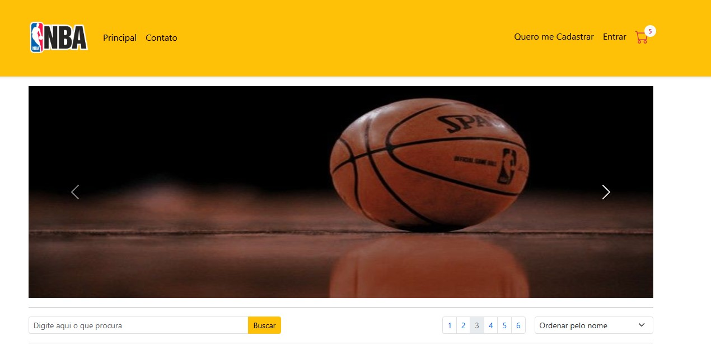

<h1>Loja Crossover - Artigos Esportivos</h1>
<h2>Imagens do Projeto</h2>

<h2>Descrição do Projeto</h2>
Este projeto é um site para a Loja Crossover, especializada em artigos esportivos. Foi desenvolvido utilizando o framework Bootstrap para um design responsivo e moderno. O objetivo principal é apresentar os produtos da loja com navegação fluida, uma barra de navegação intuitiva e um carrossel de imagens destacando os principais itens.

<h2>Estrutura de Arquivos</h2>
<ol>
<li>HTML: Página principal (index.html) </li>
<li>CSS: Arquivo personalizado em /css/style.css para ajustes específicos no design. </li>
<li>Imagens: Localizadas na pasta /img/.
Inclui slides para o carrossel e ícones para favicons. </li>
<li>Dependências do Bootstrap: Arquivos CSS e JavaScript do Bootstrap e Bootstrap Icons.</li>
</ol>
<h2>Tecnologias Utilizadas</h2>
<ul>
<li>HTML5: Estruturação semântica do conteúdo.</li>
<li>CSS3: Personalizações adicionais no estilo do site.</li>
<li>Bootstrap 5: Design responsivo e componentes prontos.</li>
<li>Bootstrap Icons: Ícones estilizados.</li>
</ul>
<h3>Como Executar o Projeto</h3>
<ol>
<li>Clone este repositório ou baixe o código-fonte.</li>
<li>Certifique-se de que os arquivos e pastas estão organizados como descrito acima.</li>
</ol>
<h3>Personalização</h3>
<ul>
<li>Para alterar as imagens do carrossel, substitua os arquivos localizados em /img/slides/.</li>
<li>Modifique as cores e estilos no arquivo /css/style.css.</li>
</ul>
<h2>Créditos</h2>
Desenvolvido com ❤️ e Bootstrap por Fillipe Moreira, inspirado no projeto [Quitanda Online](https://github.com/maroquio/QuitandaOnlineBS5) do professor Ricardo Maróquio.
